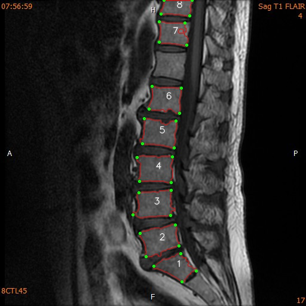

# ITRI_project2
前處理皆為使用機器學習K-means將整張圖片改為三種灰階大小，椎骨一般落在第二大的灰階區域。

原始圖檔存在training_img資料夾，輸出圖檔及CSV檔存在各自名字的資料夾中的result_files資料夾。
## 柏翰 :
> approxPolyDP(多邊形逼近)找出四個端點

***
## 洪邦 :
> minAreaRect(最小面積的Bounding Rect)找出四個端點

